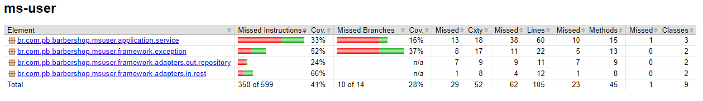
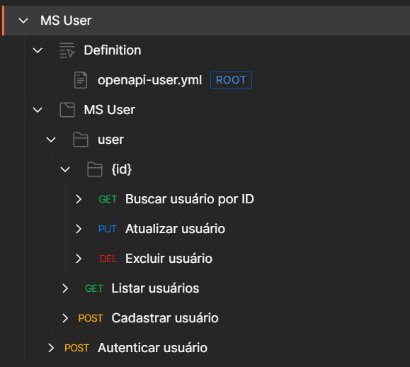

# MS User


- URL: http://localhost:8081/api/barbershop/user
- [Swagger - OpenAPI](https://github.com/pbBarbershop/ms-user/blob/master/src/main/resources/openapi.yaml)
- MySQL Workbench
- [Dockerfile](https://github.com/pbBarbershop/ms-user/blob/master/Dockerfile)





## Exemplo de cURL

### POST - Autenticar Usuário

`/auth/login`

```cURL
curl --location --request POST 'http://localhost:8081/api/barbershop/auth/login' \
--header 'Content-Type: application/json' \
--header 'Accept: application/json' \
--data-raw '{
  "email": "aliquip culpa et dolore",
  "password": "ipsum Ut "
}'
```

### POST - Cadastrar Usuário

`/user`

```cURL
curl --location --request POST 'http://localhost:8081/api/barbershop/user' \
--header 'Content-Type: application/json' \
--header 'Accept: application/json' \
--data-raw '{
  "name": "RCIcÃÉÉvurG",
  "password": "aliquip consequat magna sint",
  "phone": "8",
  "profileName": "Manager",
  "id": 81891569,
  "email": "ut ut voluptate",
  "description": "ut qui"
}'
```

### GET - Listar Usuários

`/user?name=culpa proident&page=99257794&size=15104249&sort=["ea aute dolor non","consequat Excepteur"]`

```cURL
curl --location -g --request GET 'http://localhost:8081/api/barbershop/user?name=culpa proident&page=99257794&size=15104249&sort=["ea aute dolor non","consequat Excepteur"]' \
--header 'Accept: application/json'
```

### GET - Listar Usuário

`/user/:id`

```cURL
curl --location --request GET 'http://localhost:8081/api/barbershop/user/-56746167' \
--header 'Accept: application/json'
```

### DEL - Excluir Usuário

`/user/:id`

```cURL
curl --location --request DELETE 'http://localhost:8081/api/barbershop/user/-56746167' \
--header 'Accept: application/json'
```

### PUT - Atualizar Usuário

`/user/:id`

```cURL
curl --location --request PUT 'http://localhost:8081/api/barbershop/user/-56746167' \
--header 'Content-Type: application/json' \
--header 'Accept: application/json' \
--data-raw '{
  "name": "MT rzÊmÔã",
  "password": "magna ullamco esse Excepteur",
  "phone": "99204724617",
  "profileName": "Customer",
  "id": -81024363,
  "email": "anim reprehenderit consectetur Lorem sunt",
  "description": "sed eu proident ad"
}'
```
